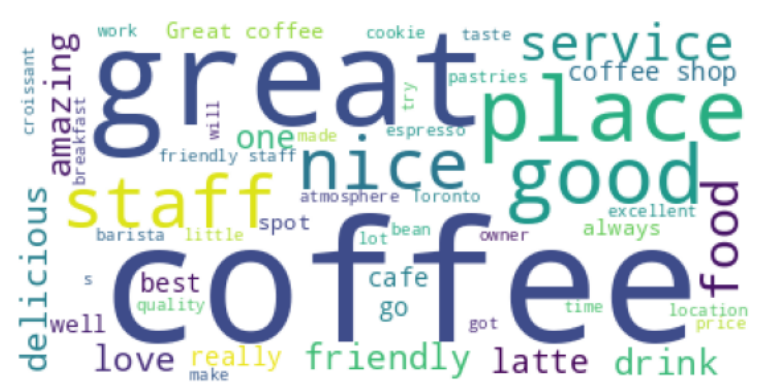
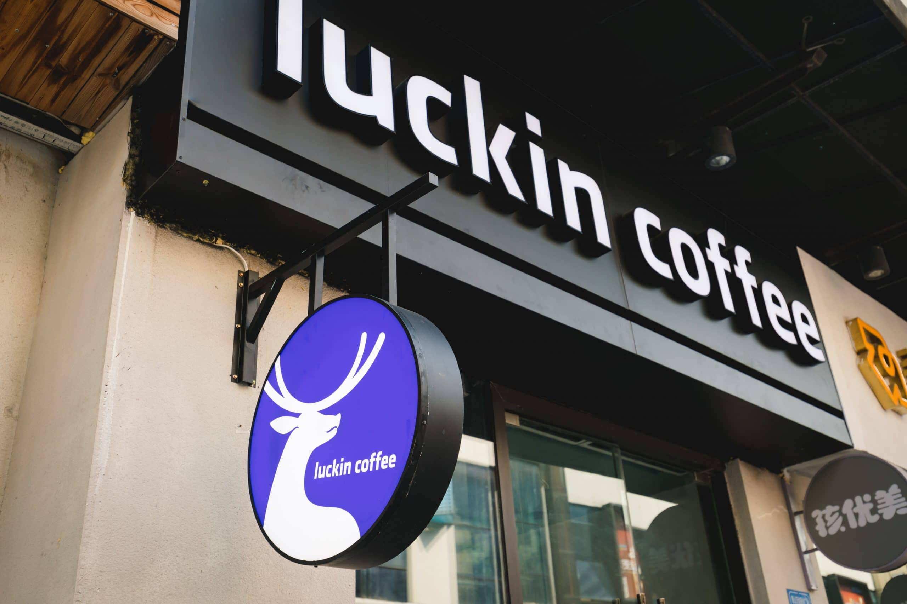
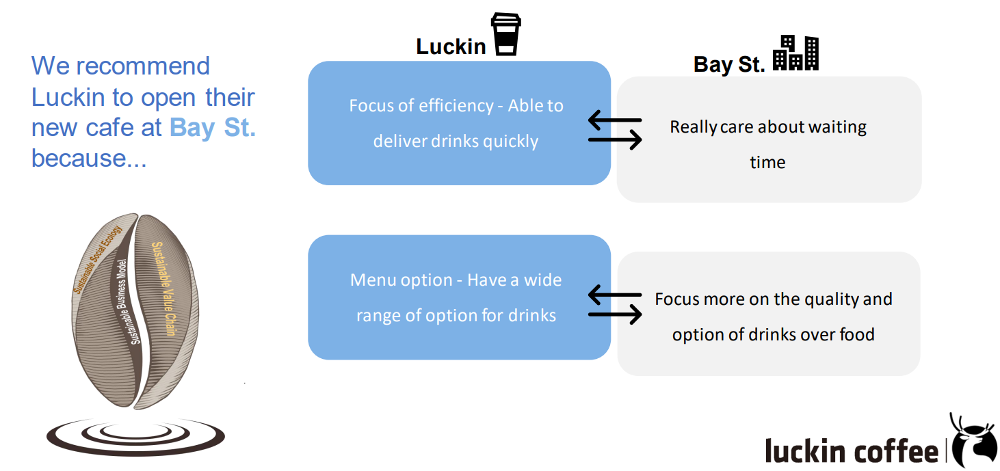

# Cafe-Industry-in-Toronto
This project consists of two parts: The first part uses NLP (Natural Language Processing) to analyze the Toronto café industry, while the second part offers business strategies for the Chinese Coffee Brand, Luckin, to enter the Toronto market, leveraging insights from the first part.  
 
Tools: Python (gensim, wordcloud, matplotlib, selenium, pandas, numpy), PowerPoint

# 🏣Part #1 - Industry Analysis
## Description
As someone who loves coffee and is interested in Toronto's café world, it's important for those wanting to open a café to know what customers like and to ask for their opinions. Doing research is key to making a café stand out and do well in Toronto. NLP (a way to understand text data) is a great tool for looking at what people say because most of the information comes in words.

## Objective
Our team, acting as data consultants, is tasked with aiding a café in selecting the optimal location between Queen St. E. and Bay St., catering to its specialty in coffee and meal offerings for breakfast and lunch. The owner views their diverse menu as a key competitive edge but faces budget constraints affecting decisions on interior decor versus staff hiring to enhance customer experience initially. Beyond location and these decisions, they seek further advice for success.

## Data Collection and Methodology
To analyze the café industry in Toronto, we collected reviews from Google Maps for 12 cafes in Queen St. E. and Bay St. using web scraping. Our "getReviews" function, utilizing Selenium in Python, extracts review details like user name, date, rating, and text by interacting with Google Maps. We stored the data in a Pandas DataFrame, gathering 3262 reviews for market research insights.

## Results
The WordCloud Analysis reveals common words from customer reviews, aiding restaurateurs in pinpointing what matters most to patrons. For location decisions, we analyzed preferences in the Queen St E. and Bay St. areas. Additionally, logistic regression and Naive Bayes models highlighted "amazing," "downtown," "delicious," "awesome," and "friendly" as key positives in reviews, while negatives often mentioned "server," "overpriced," "use," "salad," and "bad." These insights help understand customer feedback and preferences. Below is one example of the WordCloud.

 

 WordCloud of most frequently mentioned in the positive reviews

## Business Insights
The analysis reveals that Queen St. E customers prioritize food, evident from its frequent mention in reviews, unlike in Bay St. This suggests Queen St. E as the better location for our client's food-focused café, especially since negative reviews highlight a demand for better food options. Given the emphasis on 'service' in reviews, investing in quality staff over interior design is advisable to stand out, particularly in Queen St. E where service often garners criticism.
Key recommendations include concentrating on breakfast with popular items like cheese, eggs, and salad to attract morning customers. Additionally, addressing complaints about long wait times in Queen St. E could significantly improve customer experience and competitive edge.

## Files
Refer to [cafe_reviews_scrapping.ipynb](cafe_reviews_scrapping.ipynb) for data scrapping code using Python  
Refer to [cafe_reviews_analysis.ipynb](cafe_reviews_analysis.ipynb) for NLP analysis code using Python  
Refer to [CafesURL.xlsx](CafesURL.xlsx) for the names of the selected cafés  
Refer to [cafe_report.pdf](cafe_report.pdf) for the detailed procedural explanations

# ☕Part #2 - Strategies for Luckin to select a location

 

## Description
Business Assumptions: Luckin Coffee, China's leading coffee chain, is looking to expand into the Canadian market, focusing on Toronto's Queen St. E and Bay St. areas. They have enlisted the expertise of McGill MMA's professional data team to pinpoint locations that best match Luckin Coffee's brand identity and to offer precise location recommendations.

## Methodology
After revisiting the findings from part 1 and adjusting them to better suit Luckin's business strategy, we have formulated multiple recommendations for Luckin.

 

If Luckin wants to start their cafe at Neighborhood 1 
Queen St. E, we recommend:
1. incorporating low-carb and beach-related themes in the store's finishing and menu offerings
2. prioritizing customer service and encouraging neighborhood engagement
3. ensuring shorter wait times
4. optimized pricing strategy

If Luckin wants to start their cafe at Neighborhood 
2 Bay St., we recommend:
1. maintaining a positive store environment by improving staff friendliness and efficiency
2. ensuring beverage quality
3. addressing any issues related to store size, wait times, or customer expectations
4. offering a variety of flavors and menu options to meet customer preferences

## Files
Refer to [Luckin-Strategy.pdf](Luckin-Strategy.pdf) for the detailed explanation of strategies
